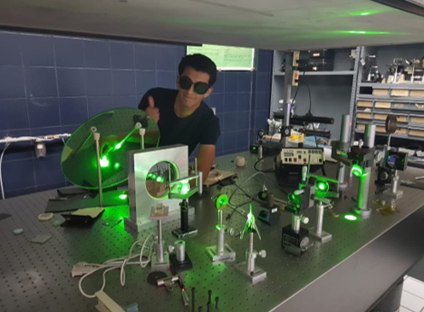
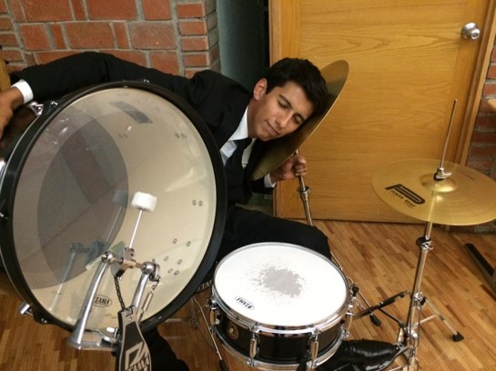

Hi there, I’m Alex Muñoz. I’m a physics engineer and a data science student from Mexico City. 

I’m in love with science and I really enjoy teaching and shearing the wonder of knowledge. I have given conferences on two occasions in the public library of Vasconcelos at Mexico City, you can find the videos of those conferences here (everything is in spanish): 

* [Entropy and something more](https://www.youtube.com/watch?v=qWazV7h8LOA&t=3366s)
* [Chaos: the hurricane flight of butterflies]( https://www.facebook.com/bibliotecavasconcelos.buenavista/videos/373696481156954)

I have also collaborated in Radio Ibero 90.9FM in the program “Random” also making popularization of science for more than a year. Currently I’m the creative director and host of the podcast “Datos + Algoritmos + Sociedad” at ITAM were I run interviews with people that work on projects involved in informatics and data that have a good impact in the society. You can find the podcast episodes here:}

* [Youtube]( https://www.youtube.com/watch?v=daO88cI9Q28&t=89s)
* [Spotify]( https://open.spotify.com/show/3EWfNunxiblCgbq3oB6dcM) 

On top of that I also give private online classes of physics and mathematics for more than a year now. Mostly to high school students and first semester’s students. 
Finally, there is a more artistic side of me, I’m also keen on music. I play the piano and the drums since I was a teenager. Now I record songs with my band on my home studio. We still don’t have a presence online, we are working on it, but here is a YouTube channel where I make my mess and some covers. I consider myself a good instrumentalist, but I still need to take some singing lessons haha.  

* [Alex Music]( https://www.youtube.com/watch?v=u0Sk0Wr0BPg) 

