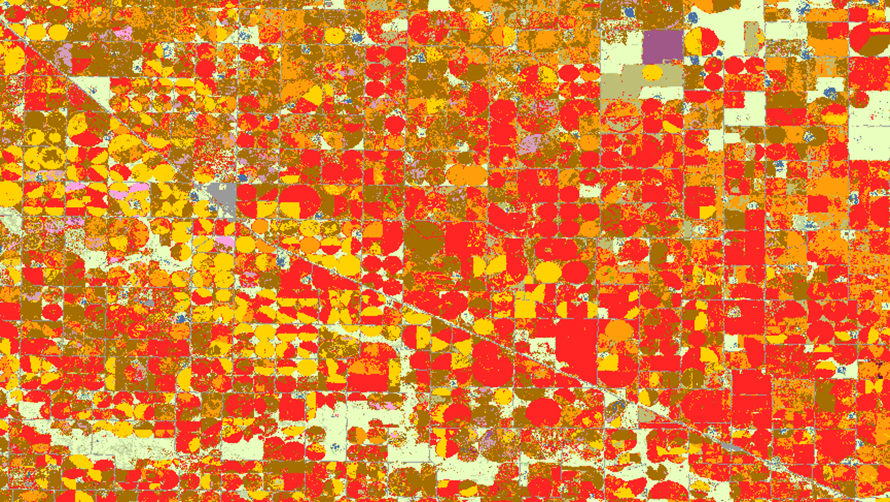
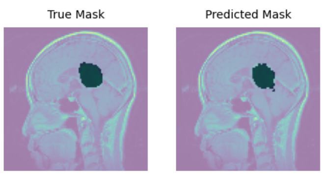
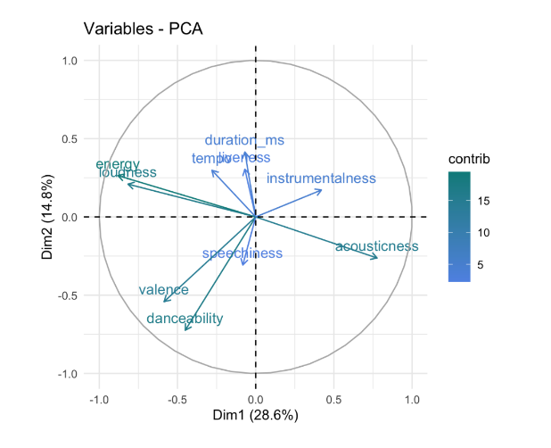
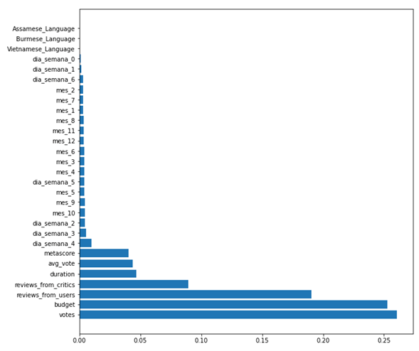
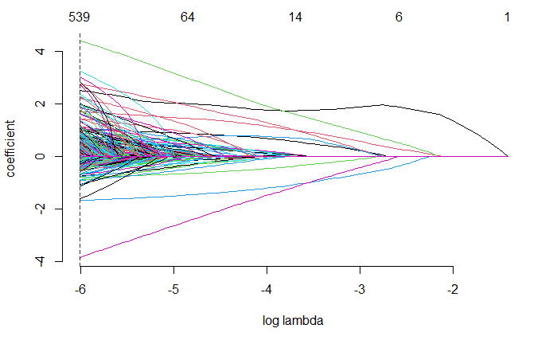
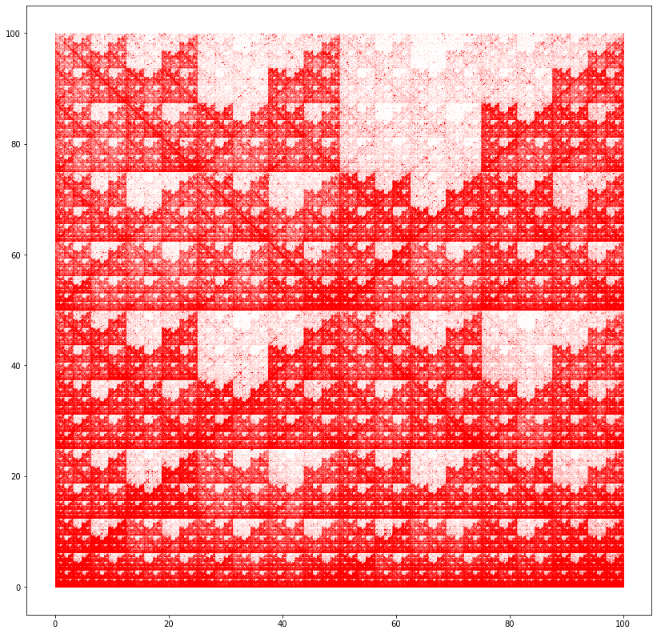

# Ana's Portfolio

Hi, my name is Ana Muñoz. Welcome to my public portfolio, where I share my data science skills.

I’m a physics engineer and a data science masters student at [ITAM](https://en.wikipedia.org/wiki/Instituto_Tecnológico_Autónomo_de_México). I have a deep interest in science and the understanding of the world, and also shearing that knowledge. More about me and my interests [here](https://github.com/Monfiz/Alex_Portfolio/blob/main/About_alex.md).  

Here you can find my CV in [Spanish]( https://github.com/Monfiz/Alex_Portfolio/blob/main/Ana_Mu%C3%B1oz_CV.pdf) and in [English](https://github.com/Monfiz/Alex_Portfolio/blob/main/Ana_Munoz_CV.pdf) where you can see mostly my academic career and associative life. 

* 📫 How to reach me: ana.clavius@gmail.com

On this portfolio currently you can find 6 projects:

## [Project 1 – Crop Remote Sensing:](https://github.com/Monfiz/Anas_crop_remote_sensing)

Wheat is one of the most important crops to feed the population. Regardless of its iportance, obtaining global estimates of the total amount of wheat being cultivated each
year before the harvest season is difficult due to lack of quality data. Recently, machine
learning methods relying on satellite imagery have been explored for this purpose. This
work focuses on the use of deep learning techniques and in particular on transfer learning
methods for predicting winter and spring wheat production based on remote satellite
data and agricultural nacional statistics on the US territory.

The results compared to the state of the art, show an overall better performance in
various metrics. Additionally, our results demonstrate that transfer learning to different
crops cannot be achieved with our approach.

This work was developed under the supervision of Prof. Dr. Magda Gregorov´a in
collaboration with the green spin company.

## [Project 2 – Brain Tumor Detection:](https://github.com/mig-calval/brain-tumor-detection)
In this Project we made a CNN capable of classifying 3 kinds of brain tumors. We arrived at 
really good accuracies for the 3 classes, from 85% to 99%. Additionally, we developed a CNN to mask the area of the tumor on the images.

## [Project 3 – Music Data Analysis:](https://github.com/Monfiz/Music_Data_Analysis )
We were curious about
what makes a song a “great song”. To answer this question we worked with two
datasets. The first one is a Spotify database that we found in Kaggle which contains
more than 160,000 songs with all kinds of metrics about the song (name, author,
bpm, acousticness, and more), the second one contains the 500 greatest songs of all
time according to the Rolling Stones magazine. This second dataset just contains
the name of the song, the artist and the year of release.

Our goal was to join these two datasets into one and to incorporate the information
of the Spotify variables into the top 500 songs. With this new information, we made
an analysis to compare if there were any differences between an average song in
Spotify in comparison to the top 500.

## [Project 4 – Movie Clustering and Movie Revenue Prediction:]( https://github.com/Monfiz/Alex_Portfolio/tree/main/Project_1)
This project is subdivided into two smaller ones, the first is an **unsupervised machine learning algorithm** that makes **clusters** of movies to make recommendations that are similar to an specific movie. The second one is a predictor of how much revenue a movie will make. For this second problem I use several models like **nearest neighbor**, **decision tree**, **random forest**, **linear regression** and more. The code is built in Python.
 

## [Project 5 - Hotel Cancellations Predictor:]( https://github.com/Monfiz/Alex_Portfolio/tree/main/Project_2)

On this project I make use of **machine learning models** such as **linear regression** with **lasso** and **random forest** to make a prediction if a hotel reservation is going to be canceled or not. The code is built in R. 

## [Project 6 – Analysis of coding and non-coding DNA:](https://github.com/Monfiz/Alex_Portfolio/tree/main/Project_3)

On this project I apply the [multifractal theory]( https://en.wikipedia.org/wiki/Multifractal_system#:~:text=A%20multifractal%20system%20is%20a,systems%20are%20common%20in%20nature.) to make an analysis of the complexity of the coding and [non-coding DNA]( https://en.wikipedia.org/wiki/Non-coding_DNA#:~:text=Non-coding%20DNA%20sequences%20are,do%20not%20encode%20protein%20sequences.&text=Other%20functions%20of%20non-coding,DNA%20replication%2C%20centromeres%20and%20telomeres.). But first, I justify the use of this theory by showing that the DNA presents a multifractal structure. The code is built in Python. Here I show my maths and coding skills applied to solve a specific problem, in this case a bioinformatics one.   

